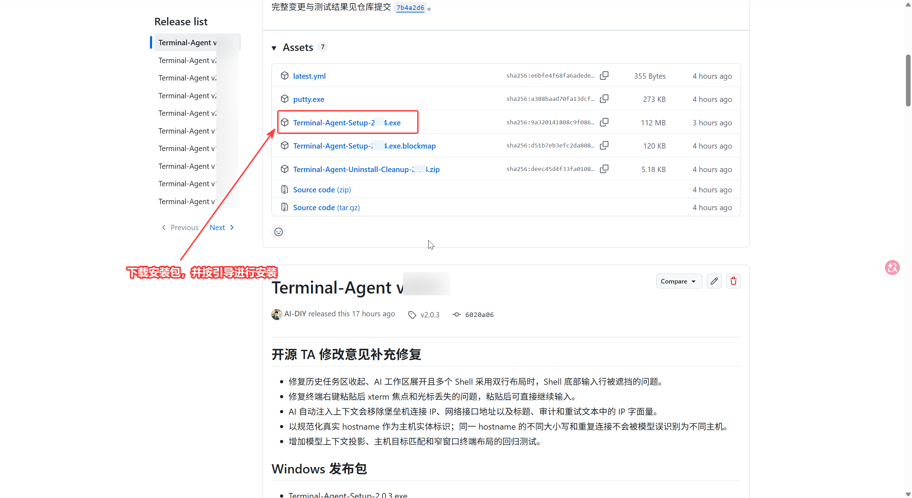
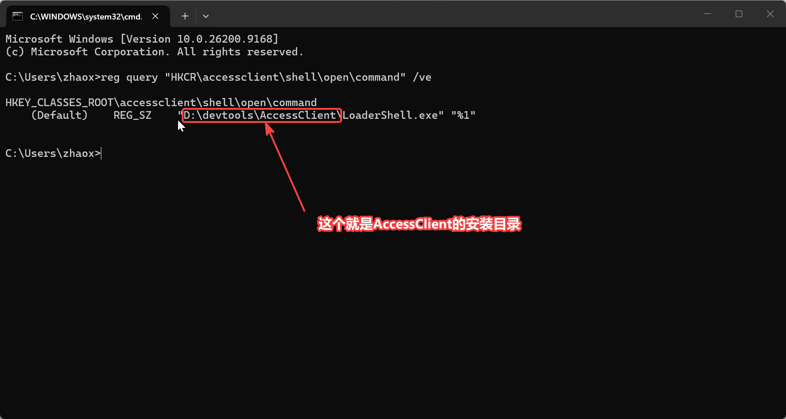
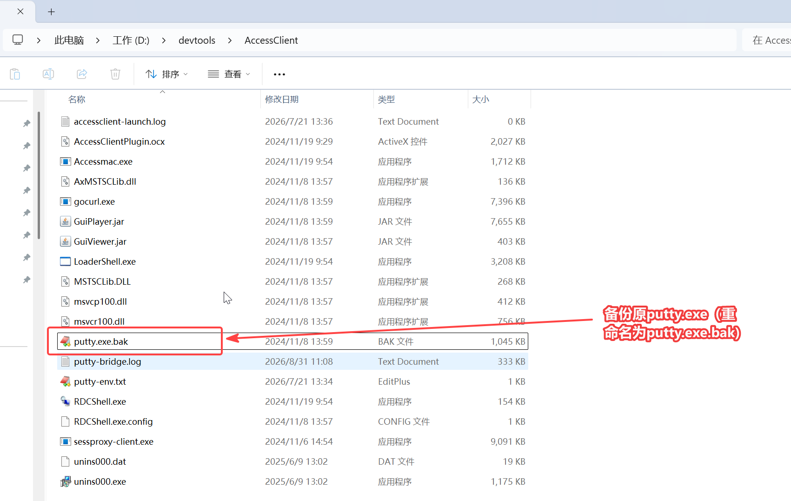
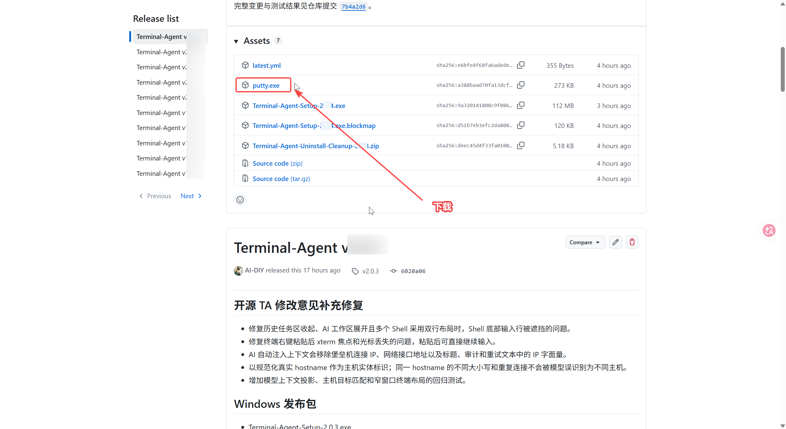
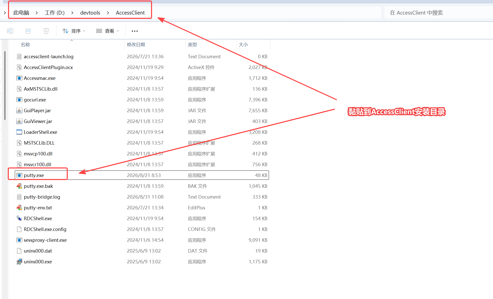

# Terminal-Agent

Terminal-Agent 是面向日常运维与企业堡垒机场景的 Windows SSH 工作台。它保留熟悉的 SSH Shell 操作方式，将堡垒机入口、多个 Shell、任务上下文和 AI 建议放在同一工作台，并通过人工审核后执行的任务流协助分析、排障和制定下一步。

## 快速开始

### 1. 下载安装TA（AccessClient）

访问 [Releases](https://github.com/AI-DIY/Terminal-Agent/releases) 下载Terminal-Agent-Setup-x.x.x.exe 并按引导进行安装。



### 2. 获取AccessClient路径

执行以下指令，获取AccessClient安装路径

```
reg query "HKCR\accessclient\shell\open\command" /ve
```



### 3. 备份AccessClient原文件

重命名AccessClient目录的原putty.exe为putty.exe.bak



### 4. 复制putty中继程序到AccessClient

访问 [Releases](https://github.com/AI-DIY/Terminal-Agent/releases) 下载putty.exe ，粘贴到AccessClient目录。





### 5. 堡垒机正常使用

（1）**堡垒机“会话配置”必须改为全局putty。**


（2）使用集团堡垒机正常唤起shell连接即可。


