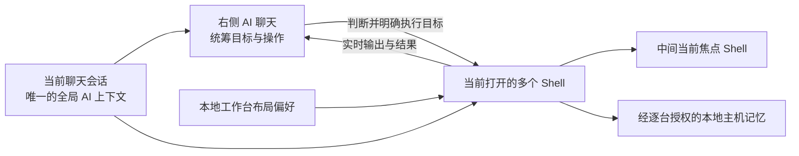
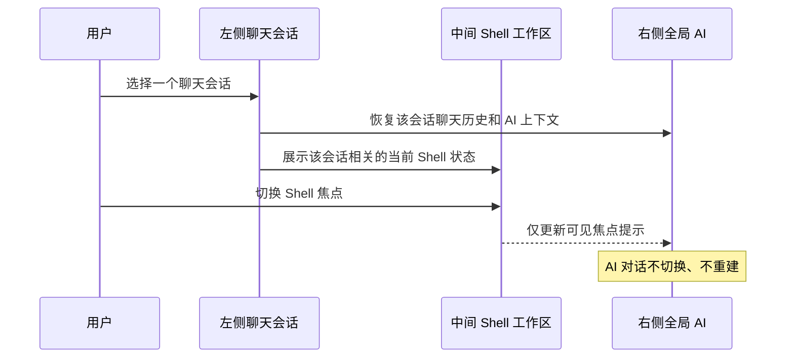
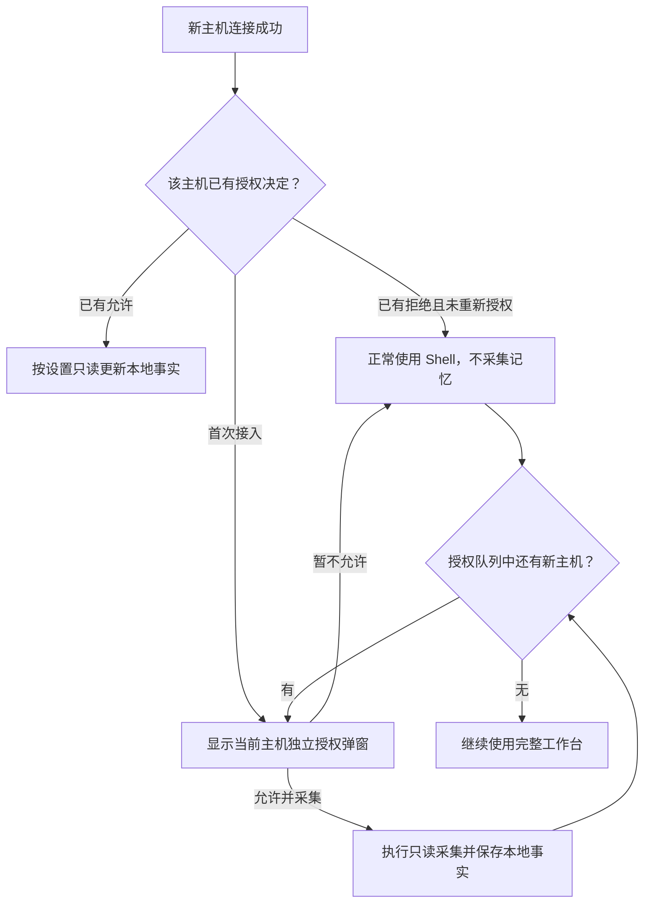
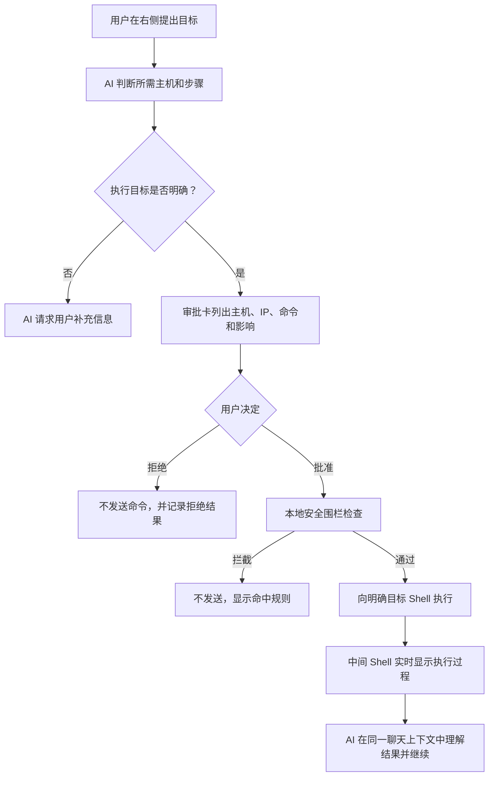
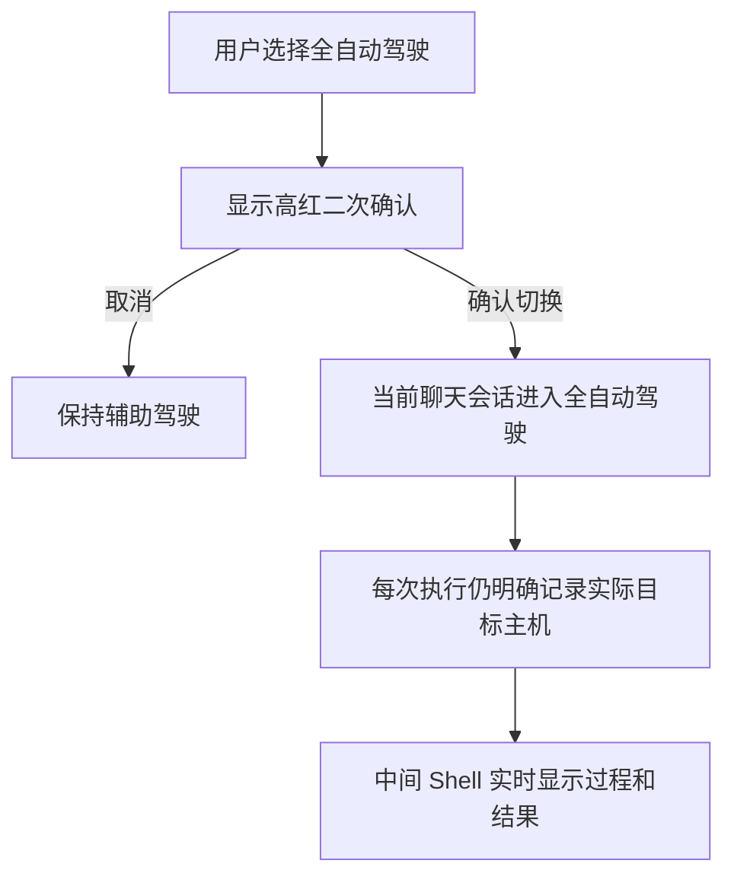

# Terminal-Agent 全局 AI Shell 工作台产品设计方案

> 文档状态：待用户评审确认
> 设计基线：V6 系统精修交互蓝图
> 文档日期：2026-08-12
> 设计范围：产品关系、页面信息架构、交互规则、视觉规范和验收口径
> 非本阶段范围：技术实现方案、代码改造、接口定义和实施排期

## 1. 文档目的

本方案将已经通过多轮交互确认的 Terminal-Agent 工作台蓝图固化为正式产品设计基线，供后续产品评审、视觉验收和实施规划使用。

本方案最重要的产品定义是：

**Terminal-Agent 是一个面向 Shell 场景的通用智能体工作台。右侧 AI 统筹当前聊天会话中的全部相关 Shell；AI 不隶属于某个 Shell，也不会随着 Shell 焦点切换而切换对话。**

页面采用稳定的三栏结构：

1. 左侧：聊天会话历史；
2. 中间：Shell 主机标签与可自定义画布；
3. 右侧：当前聊天会话唯一的全局 AI 对话。

本方案不把产品限定为故障排障、日志分析或某一种运维任务。环境检查、发布、初始化、诊断、配置核对、批量操作及未来可扩展的 Shell 工作，都属于通用智能体围绕用户目标推进工作的不同场景。

### 1.1 与既有文档的关系

- 本方案是工作台页面与交互关系的最新产品设计基线；
- 凡涉及三栏信息架构、聊天会话与 Shell 的关系、AI 上下文归属、驾驶模式位置与生命周期、Shell 布局、主机记忆授权和视觉规范，以本方案为准；
- `terminal-agent-plan-v2.md` 中的连接方式、AccessClient 兼容边界、受控执行和底层安全约束，不因本方案而取消；
- 如果旧文档中的“会话”可被理解为单个 Shell，而本方案明确写为“聊天会话”，应采用本方案的定义：聊天会话是全局 AI 工作上下文，Shell 会话是其中可被观察和操作的终端实例；
- V6 HTML 蓝图是本方案的交互视觉参考，不替代本方案中的产品规则；实现验收以本方案正文和验收标准为准。

## 2. 已确认的设计结论

以下结论是本方案的约束，不再作为待选方案：

1. AI 是当前聊天会话的全局统筹者，不按 Shell 创建多个 AI，也不随 Shell 切换。
2. 左侧记录的是 AI 聊天会话，不是主机管理器或 Shell 列表。
3. 一个聊天会话可以关联多个 Shell；新增或关闭 Shell 不会新建、删除或拆分聊天会话。
4. 中间区域负责全部 Shell 展示和人工操作，右侧 AI 可以协调这些 Shell 并将执行效果实时反映在中间终端中。
5. Shell 区域不得出现辅助驾驶、全自动驾驶或其他 AI 模式控制。
6. 辅助驾驶和全自动驾驶只属于右侧 AI 聊天，并使用始终可见的单选控件。
7. AI 在执行命令前必须明确列出执行目标主机；不得显示“上下文：全部 Shell”这类无法表达真实执行范围的标签。
8. 左右侧栏都可以调整宽度、收起和展开，并使用直白文字说明操作。
9. Shell 画布不是固定九宫格或固定 `2 × 2`，而是由展示数量、每行数量和单行高度共同决定。
10. Shell 布局、侧栏状态和主题在本地记忆，下次进入时恢复。
11. 每台新主机首次接入时，单独询问是否允许建立本地主机记忆；拒绝不影响 Shell 使用。
12. 产品提供珍珠白和石墨黑两套 IDEA 风格主题，并跟随所选主题表现选中态、焦点态和滚动条。
13. 顶栏只保留品牌、当前聊天信息和设置入口；“新建 SSH”和“已保存会话”不属于该工作台顶栏。

## 3. 产品定位

### 3.1 一句话定位

Terminal-Agent 是一个把全局 AI 调度、多个可交互 Shell 和本地主机记忆整合到同一桌面工作台中的 Shell 通用智能体。

### 3.2 核心价值

- **全局理解**：AI 在一个连续聊天上下文中理解当前目标和多个 Shell 的状态，不要求用户逐个 Shell 重复解释。
- **人机协同**：用户可以亲自操作任意 Shell，也可以让右侧 AI 协调中间多个 Shell，并实时看到执行过程和结果。
- **明确控制**：辅助驾驶和全自动驾驶具有清楚、持续可见的状态，命令执行目标在执行前明确展示。
- **环境连续性**：经用户逐台授权后，本地记忆保存主机基础事实，减少后续会话反复采集相同信息。
- **迁移友好**：主机标签、终端画布和工作方式接近 Xshell/IDEA 用户熟悉的桌面工具认知，降低上手成本。

### 3.3 目标用户

- 日常使用 Xshell、SecureCRT、IDEA Terminal 等工具的系统管理员和研发人员；
- 需要同时观察或操作多台主机的发布、运维、测试和研发人员；
- 希望 AI 参与 Shell 工作，但仍要求明确目标、权限和执行反馈的专业用户。

### 3.4 典型使用方式

1. 用户进入一个已有聊天会话，继续处理之前的工作目标；
2. 当前会话中存在一个或多个已打开 Shell；
3. 用户可以在中间选择某个 Shell 亲自操作；
4. 用户也可以在右侧告诉 AI 一个全局目标；
5. AI 判断需要读取或操作哪些主机，并在执行前明确目标；
6. 命令运行及结果实时出现在对应的中间 Shell 中；
7. AI 在同一聊天上下文中继续理解结果并推进目标。

## 4. 产品对象与关系

### 4.1 核心对象

| 对象 | 定义 | 页面归属 | 关键规则 |
| --- | --- | --- | --- |
| 聊天会话 | 一次可持续恢复的全局 AI 工作上下文 | 左侧会话栏、右侧 AI | 不随 Shell 切换；标题由 AI 自动生成 |
| Shell 会话 | 一个可交互的终端连接实例 | 中间工作区 | 可以被选择、显示、全屏或关闭 |
| 主机 | Shell 背后的远端环境身份 | 中间主机标签、主机记忆 | IP 是属性，不单独代表稳定身份 |
| Shell 焦点 | 当前人工主要查看或输入的 Shell | 中间标签和终端卡片 | 只改变画布焦点，不改变 AI 对话 |
| AI 上下文 | 当前聊天历史、相关 Shell 状态和已授权主机事实 | 右侧 AI | 面向当前聊天会话全局存在 |
| 驾驶模式 | AI 的执行权限表现 | 右侧 AI | 当前聊天会话级，不是 Shell 级 |
| 本地主机记忆 | 用户授权后保存在本机的结构化主机事实 | 首次授权弹窗、设置页 | 每台主机独立授权、独立清除 |
| 工作台布局 | Shell 展示数量、每行数量、行高和侧栏状态 | 中间画布、左右侧栏 | 本地记忆并在下次进入时恢复 |

### 4.2 关系图



### 4.3 不允许出现的错误关系

后续实现不得出现以下行为：

- 切换 `web-01`、`web-02` 等 Shell 标签时，右侧 AI 自动切换成不同对话；
- 每打开一个 Shell，就自动新增一条聊天会话；
- 关闭一个 Shell，就删除当前聊天会话或清空 AI 历史；
- 将驾驶模式展示在 Shell 标签、Shell 卡片或中间工具栏；
- 将当前焦点 Shell 等同于 AI 必须执行的唯一目标；
- 将“所有打开的 Shell”无条件标记为命令执行对象。

### 4.4 会话数量与 Shell 数量

聊天会话数量和 Shell 数量是两个独立维度。

- 新增一个 Shell：当前聊天会话数量不变；
- 通过堡垒机或外部兼容启动新增一个 Shell：当前聊天会话数量不变；
- 在同一个聊天会话中关闭一个 Shell：聊天记录和聊天会话仍保留；
- 当前激活的聊天会话自动获得工作台内全部已打开 Shell 的可用状态，不需要用户手工勾选上下文范围；
- 新打开的 Shell 自动进入当前聊天会话可判断的环境范围，但不因此成为任何命令的默认执行目标；
- 左侧会话项可以显示“关联 Shell 数”作为元信息，但该数量不是会话数量；激活会话显示当前关联数，非激活历史会话显示其最近一次保存时的关联数。

## 5. 总体信息架构

### 5.1 页面骨架

工作台由顶栏和三栏主体组成：

```text
┌──────────────────────────────────────────────────────────────────────┐
│ Terminal-Agent  当前聊天 / AI 自动生成标题                    设置 │
├──────────────┬───────────────────────────────────┬───────────────────┤
│ 左：聊天会话 │ 中：主机标签 + Shell 可定制画布  │ 右：全局 AI 聊天 │
│ 可调宽/收起  │ 页面核心区域，可横纵滚动和全屏   │ 可调宽/收起      │
└──────────────┴───────────────────────────────────┴───────────────────┘
```

### 5.2 顶栏

顶栏仅包含：

- Terminal-Agent 品牌标识；
- 当前聊天会话标题；
- 设置入口。

顶栏不包含：

- 新建 SSH；
- 已保存会话；
- 驾驶模式；
- 模糊的全部 Shell 上下文选择器；
- 与当前工作台主流程无关的快捷入口。

### 5.3 三栏优先级

- 中间 Shell 工作区是视觉和操作核心，占据最大可变空间；
- 左侧聊天会话用于导航，通常可保持收起以释放空间；
- 右侧 AI 聊天用于持续协作，正常操作时保持展开；
- 用户亲自操作 Shell 时，可以收起左右两栏以最大化中间空间；
- 用户主要让 AI 操作时，可以收起左栏，保留中间实时 Shell 和右侧 AI。

## 6. 左侧：聊天会话栏设计

### 6.1 职责

左侧只负责聊天会话的创建、展示、切换和历史浏览，不承担主机或 Shell 管理。

### 6.2 顶部信息

左侧顶部包含：

- 标题：`聊天会话`；
- 辅助说明：`标题由 AI 自动生成`；
- 直白的折叠按钮：`收起`；
- 主操作：`新建聊天`。

### 6.3 会话项

每条聊天会话至少显示：

1. AI 自动生成的标题；
2. 新建日期或时间；
3. `新建`标识；
4. 当前或最近关联的 Shell 数量。

显示规则：

- 当天会话按“今天”分组，元信息优先显示创建时间；
- 非当天会话按自然日期分组，元信息显示日期，必要时补充时间；
- 标题优先单行展示，超出宽度时省略；
- 数字使用稳定对齐，便于快速扫描；
- 当前会话使用中性选中背景和左侧细主题色指示线，不使用大面积高饱和蓝色。

示例：

```text
今天
多环境发布准备
19:21 新建                         6 个 Shell

应用配置批量核对
16:08 新建                         4 个 Shell
```

### 6.4 折叠与宽度

- 左栏支持拖动分隔线调整宽度；
- 展开状态显示`收起`文字和方向图标；
- 折叠状态保留一条窄工具栏，显示`展开聊天`；
- 折叠入口不能只用难以理解的单个箭头；
- 用户调整后的宽度和折叠状态保存在本地；
- 首次使用建议默认收起左栏，之后以用户最后一次状态为准。

### 6.5 切换聊天会话

切换左侧会话时：

- 右侧切换为该聊天会话的历史和当前 AI 上下文；
- 中间显示与该聊天会话相关的当前 Shell 状态；
- 不因为中间某个 Shell 被选中而再次切换 AI；
- 驾驶模式按聊天会话隔离，不成为全局应用设置。

## 7. 中间：Shell 工作区设计

### 7.1 职责

中间区域承载全部 Shell 展示、人工操作、主机焦点切换、布局管理和实时执行反馈，是页面的核心工作区。

中间区域不承载：

- AI 聊天；
- 辅助驾驶或全自动驾驶选择；
- AI 上下文范围选择；
- 模型连接和记忆配置。

### 7.2 顶部主机标签

顶部主机标签参考 Xshell 的熟悉模式，每个标签显示：

- 连接状态点；
- `用户名@主机名`；
- 连接状态；
- 关闭按钮。

规则：

- 标签横向可滚动；
- 点击标签会聚焦对应 Shell；
- 如果该 Shell 当前不在画布展示集合中，点击标签会把它换入画布；
- 标签选中和 Shell 卡片焦点双向联动；
- 选中态使用主题相关的面板明度、字重、状态点和细底线；
- 不使用与整体风格冲突的高饱和整块颜色；
- 关闭标签只关闭该 Shell，不删除聊天会话；
- 最后一个 Shell 受到关闭保护，避免工作区失去全部终端。

### 7.3 Shell 工具栏

工具栏包含：

- 标题：`Shell`；
- 状态摘要：连接总数和画布当前展示数；
- `布局`按钮。

示例：

```text
Shell
4 个连接 · 3 个正在画布中显示                       [布局]
```

### 7.4 布局模型

Shell 画布不使用固定九宫格或固定 `2 × 2`。

布局由三个参数构成：

| 参数 | 含义 | 示例 |
| --- | --- | --- |
| 当前展示数量 `N` | 画布中同时展示多少个 Shell | 1、2、3、4 |
| 每行数量 `C` | 一行横向放置多少个 Shell | 1、2、3、4 |
| 单行高度 `H` | 每一行 Shell 的高度 | 紧凑、标准、宽松 |

联动规则：

```text
实际列数 = min(C, N)
自动行数 = ceil(N / 实际列数)
```

示例：

| Shell 总连接数 | 展示数量 `N` | 每行数量 `C` | 自动结果 |
| --- | ---: | ---: | --- |
| 4 | 1 | 1 | 展示 1 个 Shell，使用顶部标签切换其他 Shell |
| 4 | 2 | 2 | 1 行 × 2 个 |
| 4 | 4 | 2 | 2 行 × 2 个 |
| 4 | 4 | 3 | 第一行 3 个，第二行 1 个 |
| 7 | 6 | 3 | 2 行 × 3 个，其余 Shell 通过标签切换 |

竖向展示数量不设置独立输入框，由展示数量和每行数量自动计算，避免两套参数互相矛盾。

### 7.5 高度与滚动

- 产品页面本身填满桌面窗口可用高度，不使用固定产品高度；
- 用户控制的是单行高度，不是整个画布的固定总高度；
- 多行内容超过可用高度时，中间画布纵向滚动；
- 每行内容超过可用宽度时允许横向滚动，不强制压缩到不可读；
- 横向和纵向滚动条跟随珍珠白或石墨黑主题；
- 布局设置保存在本地，下次进入时恢复。

### 7.6 Shell 卡片

每个 Shell 卡片包含：

- 主机名；
- 当前用户名与连接状态；
- 全屏按钮；
- 关闭按钮；
- 可交互终端正文。

视觉规则：

- 当前焦点 Shell 使用清晰的单层主题色描边；
- 非焦点 Shell 使用中性边框；
- 全屏和关闭使用统一线宽图标，不使用字体字符模拟图标；
- 终端字体优先使用等宽字体；
- 命令、成功输出、普通输出使用稳定的语义颜色；
- 焦点状态不能只依赖颜色，还需结合边框和标签联动。

### 7.7 单 Shell 全屏

- 点击单个 Shell 的全屏按钮后，该 Shell 占据中间 Shell 工作区；
- 全屏仅改变画布展示，不改变聊天会话、AI 上下文或驾驶模式；
- 退出全屏后恢复之前的展示数量、每行数量和行高；
- 全屏是临时状态，不需要作为默认布局永久覆盖用户原设置。

### 7.8 关闭 Shell

关闭动作可以从主机标签或 Shell 卡片发起，两者结果一致：

- 提示用户关闭的是当前 Shell，不是聊天会话；
- 关闭后主机标签和对应 Shell 卡片同步消失；
- 如果关闭的是当前焦点 Shell，焦点转移到仍打开的其他 Shell；
- 聊天记录不删除；
- 主机记忆不自动删除；
- 最后一个 Shell 关闭时提供保护提示。

## 8. 右侧：全局 AI 聊天设计

### 8.1 职责

右侧是当前聊天会话唯一的 AI 对话。AI 结合以下信息推进用户目标：

- 当前聊天历史；
- 当前打开的相关 Shell；
- 各 Shell 的可用状态和实时输出；
- 用户授权的本地主机记忆；
- 当前驾驶模式；
- 用户在本轮输入的目标和约束。

其中“当前打开的相关 Shell”默认指工作台内全部已打开 Shell 都可供 AI 判断，不提供人工勾选范围；“可供判断”不等于“全部执行”。每一次实际命令仍按本节的目标识别规则单独确定主机范围。

### 8.2 AI 不随 Shell 切换

中间选择某个 Shell，只表达用户当前主要查看或人工操作的终端。该焦点可以作为 AI 理解界面的一个提示，但不能产生以下行为：

- 不得切换 AI 对话；
- 不得清空聊天上下文；
- 不得把其他 Shell 自动排除出 AI 可判断的范围；
- 不得默认把焦点 Shell 当成命令执行目标。

### 8.3 右侧标题区

标题区包含：

- AI 标识；
- 标题：`AI 聊天`；
- 当前驾驶模式的文字说明；
- 直白的`收起`按钮；
- 辅助驾驶和全自动驾驶单选控件。

右侧折叠后保留窄工具栏和`展开 AI`文字。

### 8.4 驾驶模式

#### 辅助驾驶

- 是新聊天会话的默认模式；
- 使用微红色视觉；
- AI 可以读取、分析、说明策略和提出候选命令；
- 对环境产生变更的命令需要逐条审批；
- 审批只绑定当前聊天会话、明确目标主机和完整命令；
- 命令仍经过本地安全围栏检查。

#### 全自动驾驶

- 使用更强的高红视觉；
- 用户点击单选项后必须进行二次确认；
- 确认按钮使用高红，不使用普通蓝色主按钮；
- 切换后 AI 可以围绕当前聊天目标连续推进操作；
- 驾驶模式仍属于当前聊天会话，不属于某一个 Shell；
- 切换或关闭单个 Shell 不会改变当前聊天会话的驾驶模式。

#### 生命周期

- 新建聊天会话默认辅助驾驶；
- 同一次应用运行期间，聊天会话被切走再切回时保持其当前模式；
- 为避免重启后在用户无感知的情况下继续高权限状态，应用重新启动后，全自动驾驶恢复为辅助驾驶，需要重新明确确认；
- 驾驶模式不能被 AI 根据自然语言自行暗中切换。

### 8.5 命令目标识别

页面不提供固定的“全部 Shell”“当前 Shell”上下文标签。用户只需说明目标，AI 根据聊天目标、主机信息和当前状态判断执行范围。

AI 判断完成后，在任何实际执行前明确展示：

```text
执行目标：1 台主机
root@web-02（10.21.5.29）
```

多主机示例：

```text
执行目标：3 台主机
appuser@web-01（10.21.5.34）
root@web-02（10.21.5.29）
appuser@db-01（10.21.6.11）
```

规则：

- 数量、用户名、主机名和 IP 必须清楚可见；
- 多台主机逐项列出，不使用“部分主机”“所有相关机器”等模糊描述替代；
- 如果 AI 无法确定目标，必须先在聊天中请求用户补充信息，不得猜测后直接执行；
- 当前焦点 Shell 可以参与判断，但不能自动等同于执行目标；
- 全自动驾驶的执行结果同样需要显示实际目标，而不是只显示命令。

### 8.6 辅助驾驶审批卡

审批卡显示：

- 等待审批状态；
- 当前模式；
- 命令目的；
- 明确执行目标；
- 完整命令；
- 影响说明；
- 本地安全围栏提示；
- 拒绝；
- 批准并执行。

批准后：

- 卡片显示已批准；
- 命令发送到明确目标 Shell；
- 中间 Shell 实时显示执行过程和结果；
- AI 在同一聊天上下文中继续理解输出。

拒绝后：

- 卡片显示已拒绝；
- 命令不发送；
- AI 可以基于拒绝结果继续提出说明或替代方案。

### 8.7 全自动驾驶结果卡

全自动驾驶不显示逐条审批按钮，但每次重要执行结果仍显示：

- `全自动驾驶 · 已自动执行`；
- 实际目标主机列表；
- 操作目的；
- 已执行命令；
- 中间 Shell 已同步实时过程和结果的说明。

### 8.8 消息区与输入区

- 用户、AI、系统消息使用清楚的发送者和时间标识；
- AI 消息使用克制的左侧主题色指示线；
- 不使用过多横线把消息区做成表格；
- 输入框提示 AI 会判断主机并在执行前明确目标；
- 输入区不显示“上下文：全部 4 个 Shell”或类似控件；
- 发送按钮作为普通主操作使用主题蓝色，不与高风险红色混淆。

## 9. 本地主机记忆设计

### 9.1 目标

本地主机记忆帮助 AI 在后续聊天中理解已经授权的主机基础情况，减少重复询问和重复只读采集。记忆是本地结构化事实，不是把完整终端历史直接保存并反复发送给模型。

### 9.2 授权时机

- 每台新主机首次连接成功时单独询问；
- 如果一次接入多台新主机，弹窗按队列逐台展示，例如 `1 / 4`、`2 / 4`、`3 / 4`、`4 / 4`；
- 弹窗显示当前主机名、用户名和连接 IP；
- 用户对每台主机分别选择`允许并采集`或`暂不允许`；
- 拒绝某台主机不阻塞当前 Shell，也不影响其他主机授权；
- 拒绝后可以在设置页重新授权。

### 9.3 允许保存的信息

授权后可以通过只读采集保存：

- 主机名；
- 连接 IP；
- 操作系统和基础版本；
- CPU、内存、磁盘、网络等基础资源信息；
- 运行进程名称；
- PID；
- 进程工作目录；
- 当前用户；
- 当前工作目录；
- 常用服务状态；
- 与这些基础事实同类、且不包含敏感凭据的必要信息。

### 9.4 明确不保存的信息

- 密码；
- 私钥；
- 私钥口令；
- API Key；
- 令牌；
- AccessClient 或堡垒机临时凭据；
- 环境变量值；
- 完整终端内容；
- 未经用户授权的主机事实。

### 9.5 主机关联规则

- 本方案沿用既有产品规则，以主机只读观察获得的稳定主机名作为主机记忆的主关联键；
- IP 是需要展示和保存的主机属性，但不能单独作为身份键；
- 用户名也是连接属性，同一主机上的不同登录用户不自动产生多份主机记忆；
- 堡垒机、代理或动态网络环境下 IP 可能变化，IP 变化时更新属性，不自动创建另一份记忆；
- 如果观察发现两个实际环境返回相同主机名但事实明显冲突，产品不得静默合并或覆盖，应提示用户确认主机身份后再决定是否关联；
- 用户可以在设置页按主机逐台清除记忆；
- 关闭 Shell 不自动删除主机记忆。

### 9.6 授权弹窗视觉

弹窗包含：

- `新主机已连接 · x / n`；
- 分段进度指示；
- 授权标题；
- 只读采集说明；
- 当前主机名和 IP；
- 允许采集的信息摘要；
- 不采集敏感信息的说明；
- 暂不允许；
- 允许并采集。

遮罩使用轻微暗化和模糊，让用户理解当前仍处于原工作台，但需要先处理当前主机的授权选择。

## 10. 设置界面设计

### 10.1 页面结构

设置使用独立视图，不与工作台弹窗叠加。页面包含：

- 顶部：`返回工作台`和`设置`标题；
- 左侧设置导航；
- 右侧当前设置内容。

左侧导航固定为：

1. 大模型连接；
2. 安全围栏；
3. 本地主机记忆；
4. 外观。

### 10.2 大模型连接

页面字段：

- 接口地址；
- 模型名称；
- 上下文长度；
- API Key；
- 测试连接；
- 保存模型连接。

规则：

- 接口使用 OpenAI Chat Completions 兼容协议；
- API Key 只保存在本机安全存储中；
- API Key 不进入 AI 上下文；
- 留空表示保留已保存密钥，不在界面回显完整值；
- 测试和保存是两个独立动作。

### 10.3 安全围栏

页面包括：

- 规则启用状态；
- 规则名称；
- 正则表达式；
- 固定处理结果：命中即拦截；
- 删除规则；
- 新增规则；
- 测试命令；
- 测试匹配；
- 保存安全围栏规则。

视觉上使用稳定表格行，不用过多卡片。规则命中状态使用琥珀色，删除使用克制的危险色。

### 10.4 本地主机记忆

页面包括：

- 启用逐台主机记忆授权；
- 授权后的允许保存字段；
- 本地保存和敏感信息排除说明；
- 已授权主机列表；
- 主机名；
- IP；
- 最近更新时间；
- 逐台清除记忆；
- 保存记忆设置。

四类允许保存字段使用接近 IDEA 设置页的平铺设置行，不表现为大量网页卡片。

### 10.5 外观

当前设计提供两个主题预设：

- 珍珠白：接近 IDEA Light 的冷白层次；
- 石墨黑：接近 IDEA Darcula 的深灰层次。

主题选项使用微型工作台缩略图展示真实三栏层次，而不是单一色块。当前版本不提供自由颜色编辑器；后续如果需要自定义主题，应作为独立功能设计，不在本次页面设计中隐式扩张。

外观页同时说明以下设置会自动记忆：

- 当前主题；
- 左右侧栏宽度；
- 左右侧栏折叠状态；
- Shell 展示数量；
- 每行数量；
- 单行高度。

## 11. 视觉设计规范

### 11.1 总体风格

- 参考 IntelliJ IDEA 的专业桌面工具风格；
- 现代、简约、克制、信息密度适中；
- 不使用渐变、玻璃拟态、霓虹发光或数据大屏装饰；
- 不用纯白和纯黑大面积生硬铺底；
- 通过相邻面板明度、细边框、字体层级和有限状态色建立结构；
- 主界面只保留高频核心动作。

### 11.2 主题基准

| 语义 | 珍珠白 | 石墨黑 |
| --- | --- | --- |
| 顶部 chrome | 冷调浅灰 | IDEA 深灰 |
| 面板 | 珍珠灰白 | 石墨灰 |
| 主表面 | 接近白但不刺眼 | 深灰黑但非纯黑 |
| 主要文字 | 深炭灰 | 柔和高亮灰白 |
| 次要文字 | 中性灰 | 中亮灰 |
| 分隔线 | 低对比冷灰 | 低对比深灰 |
| 普通焦点与主操作 | 克制蓝 | 柔和亮蓝 |
| 连接与成功 | 绿色 | 柔和亮绿 |
| 等待审批 | 琥珀色 | 暗琥珀背景、亮琥珀文字 |
| 辅助驾驶 | 微红 | 暗微红 |
| 全自动驾驶 | 高红 | 高红但不荧光 |

### 11.3 颜色职责

- 蓝色：普通主按钮、焦点、当前 Shell 和键盘焦点；
- 绿色：主机已连接、命令成功；
- 琥珀色：等待审批和围栏提示；
- 微红：辅助驾驶；
- 高红：全自动驾驶和其二次确认；
- 危险红：删除或清除类动作；
- 不允许一个颜色同时承担互相冲突的状态含义。

### 11.4 字体层级

| 层级 | 建议范围 | 使用位置 |
| --- | --- | --- |
| 页面标题 | 18–20px | 设置页主要标题 |
| 区域标题 | 14–16px | 聊天会话、Shell、AI 聊天 |
| 正文与表单 | 12–13px | 聊天正文、设置字段、审批说明 |
| 辅助信息 | 11px | 时间、状态、Shell 数、字段说明 |
| 极弱信息 | 10px | 仅在空间受限且信息次要时使用 |

不应在关键状态、主机身份、命令目标和安全提示上依赖 `9px` 字号。

### 11.5 图标

- 使用统一线宽的线性图标；
- 全屏、关闭、折叠、展开、布局、设置和状态图标保持同一视觉体系；
- 不使用 `□`、`◆`、单个字符箭头等字体字符作为最终产品图标；
- 图标按钮保留可读的悬停提示和无障碍名称；
- 折叠按钮始终保留文字，不变成只靠图标猜测。

### 11.6 圆角、边框与阴影

- 主窗口圆角克制，约 8–10px；
- 普通按钮和输入框约 5–7px；
- 弹窗约 8–10px；
- 工作台主要依靠细边框分层，不使用大量浮动卡片；
- 只有布局菜单、确认弹窗和主窗口使用明显但柔和的阴影；
- 当前 Shell 使用单层描边，不叠加多层光圈。

### 11.7 滚动条与焦点

- 横向和纵向滚动条跟随主题；
- 默认纤细，悬停时提高明度；
- 石墨黑主题不得出现刺眼的白色系统滚动条；
- 鼠标点击后的选中态不出现浏览器默认粗黑焦点框；
- 键盘操作使用 `focus-visible` 提供主题相关焦点提示；
- 选中态不能只依赖颜色，应结合字重、指示线或边框。

## 12. 本地状态与记忆范围

### 12.1 需要本地持久化

| 状态 | 保存范围 | 恢复规则 |
| --- | --- | --- |
| 主题 | 当前用户全局 | 下次启动恢复 |
| 左右侧栏宽度 | 当前用户全局 | 下次进入工作台恢复 |
| 左右侧栏折叠状态 | 当前用户全局 | 下次进入工作台恢复 |
| Shell 展示数量 | 当前用户布局偏好 | 下次进入工作台恢复并受实际 Shell 数限制 |
| 每行数量 | 当前用户布局偏好 | 下次进入工作台恢复并与展示数量联动 |
| 单行高度 | 当前用户布局偏好 | 下次进入工作台恢复 |
| 聊天标题与历史 | 按聊天会话 | 重新进入会话时恢复 |
| 逐台主机授权与事实 | 按稳定主机身份 | 后续相关聊天中按需使用 |
| 模型连接与围栏设置 | 当前用户全局 | 下次启动恢复 |

### 12.2 不应永久保留为自动授权

- 全自动驾驶不作为应用全局偏好；
- 应用重启后恢复辅助驾驶；
- 单 Shell 全屏是临时视图状态；
- 临时审批标志不跨命令、主机、聊天会话或应用重启复用。

### 12.3 不保存

- 完整终端历史作为主机记忆；
- 密码、私钥、私钥口令、令牌和临时凭据；
- 未经授权的主机事实；
- AI 未实际确认的模糊执行目标。

## 13. 关键交互流程

### 13.1 进入聊天会话



### 13.2 新主机记忆授权



### 13.3 辅助驾驶命令流程



### 13.4 全自动驾驶切换



## 14. 异常与边界状态

### 14.1 AI 无法确定目标主机

- 不显示可执行审批卡；
- AI 在聊天中说明缺少哪些信息；
- 用户补充信息后重新判断；
- 不把当前焦点 Shell 当作默认兜底目标。

### 14.2 目标 Shell 已断开或已关闭

- 审批或执行前重新确认目标可用状态；
- 不把命令静默发送到其他 Shell；
- 右侧清楚说明具体哪台主机不可用；
- 其余可用目标是否继续，由当前模式和本轮明确范围决定，不进行隐式替换。

### 14.3 主机记忆被拒绝

- Shell 正常使用；
- AI 可以使用当前聊天中可见的即时信息，但不声称拥有该主机长期记忆；
- 设置页提供重新授权入口；
- 不重复弹窗阻断同一次已完成的连接流程。

### 14.4 主机记忆采集失败

- 授权决定保留；
- 页面说明只读采集未完成；
- 不把部分或失败结果标记为完整记忆；
- Shell 继续可用。

### 14.5 最后一个 Shell

- 关闭时显示保护提示；
- 不允许因误操作让当前工作台进入无法理解的空 Shell 状态；
- 聊天会话和 AI 历史始终独立保留。

### 14.6 窄窗口

- 优先保持中间 Shell 和右侧 AI 的最低可用宽度；
- 左侧可以自动采用上次折叠状态；
- 不把三栏挤压成无法阅读的小卡片；
- 达到最小桌面宽度后允许工作台内部滚动，而不是破坏组件布局；
- 本产品是桌面工作台，不以移动端布局为本次设计目标。

## 15. 无障碍与专业可用性

- 单选按钮使用真实单选语义；
- 折叠、展开、全屏和关闭按钮有明确无障碍名称；
- 主机标签具备标签语义和选中状态；
- 弹窗具备对话框语义、标题关联和键盘焦点管理；
- 状态不能只用颜色表达，同时使用文字、边框或图标；
- 关键文字和背景满足桌面工具基本对比度；
- 可滚动区域在键盘操作下可到达；
- 高风险确认按钮具有明确文字，不用只有颜色的无文案图标；
- 动效以快速、克制为准，不影响终端实时输出判断。

## 16. 页面级组件边界

后续实现规划时，应维持以下清晰组件边界。本节描述产品职责，不规定技术框架或文件名。

| 组件 | 单一职责 | 不负责 |
| --- | --- | --- |
| 顶栏 | 品牌、当前聊天标题、设置入口 | Shell 创建、驾驶模式 |
| 聊天会话栏 | 会话列表、创建、选择、折叠 | 主机管理、AI 执行 |
| 主机标签栏 | Shell 身份、连接状态、焦点和关闭 | AI 上下文切换 |
| Shell 布局工具栏 | 展示摘要和布局入口 | 驾驶模式 |
| Shell 画布 | Shell 排版、焦点、全屏、实时终端 | 聊天历史 |
| AI 标题与模式区 | AI 身份、驾驶模式、折叠 | Shell 排版 |
| AI 消息流 | 用户、AI、系统和执行结果消息 | 直接绕过受控执行入口 |
| 命令审批卡 | 明确目标、命令、影响和用户决定 | 模糊的全 Shell 授权 |
| 消息输入区 | 接收用户目标 | 固定指定全部 Shell 上下文 |
| 主机记忆授权弹窗 | 逐台获取明确授权 | 阻塞未授权主机的 Shell 使用 |
| 设置视图 | 模型、围栏、记忆和外观配置 | 工作台实时 Shell 操作 |

## 17. 设计验收标准

### 17.1 产品关系

1. 切换中间 Shell 时，右侧 AI 对话保持不变。
2. 新增 Shell 时，左侧聊天会话数量不变。
3. 关闭 Shell 时，聊天会话和聊天历史不删除。
4. 一个聊天会话可以统筹一个或多个 Shell。
5. 驾驶模式只出现在右侧 AI 区域。

### 17.2 左侧会话栏

1. 会话标题由 AI 自动生成。
2. 每条会话显示新建日期或时间和关联 Shell 数量。
3. 左栏可拖动调宽、收起和展开。
4. 折叠状态显示直白的`展开聊天`。
5. 选中态跟随主题且不使用突兀的大面积高饱和蓝色。

### 17.3 中间 Shell

1. 顶部主机标签可以横向滚动并切换 Shell 焦点。
2. 主机标签和 Shell 卡片焦点双向联动。
3. 布局提供展示数量、每行数量和单行高度。
4. 自动行数符合 `ceil(N / min(C, N))`。
5. `N = 1` 时只展示一个 Shell，并可通过顶部标签切换。
6. 单 Shell 可以全屏并恢复原布局。
7. 每个 Shell 和标签都有关闭入口，关闭不删除聊天会话。
8. 布局和侧栏状态在本地记忆。

### 17.4 右侧 AI

1. 辅助驾驶和全自动驾驶使用明显的单选控件。
2. 辅助驾驶使用微红，全自动驾驶使用高红。
3. 全自动驾驶切换需要高红二次确认。
4. 辅助驾驶审批卡明确显示目标主机、IP 和完整命令。
5. 多主机命令逐项列出目标。
6. AI 不确定目标时先询问，不猜测执行。
7. 页面不存在“上下文：全部 4 个 Shell”等模糊执行范围。
8. 中间 Shell 能实时看到 AI 执行过程和结果。

### 17.5 主机记忆

1. 每台新主机首次接入时单独询问。
2. 多台主机授权按队列显示进度。
3. 拒绝某台不影响 Shell 使用或其他主机授权。
4. 设置页可以配置保存字段、查看已授权主机和逐台清除。
5. 主机名、IP、进程、PID、进程目录和基础资源信息在允许范围内。
6. 密码、私钥、API Key、令牌、环境变量值和完整终端内容不保存。

### 17.6 设置与视觉

1. 设置包含大模型连接、安全围栏、本地主机记忆和外观四页。
2. 珍珠白和石墨黑主题均有清楚的面板层次。
3. 主机标签选中态、滚动条和键盘焦点跟随主题。
4. 关键辅助文字不依赖过小字号。
5. 图标使用统一线宽，不依赖字体字符。
6. 全自动驾驶确认按钮为高红，普通发送和保存按钮为主题蓝。
7. 顶栏不存在`新建 SSH`和`已保存会话`。

## 18. 设计验证方式

设计确认后，实施前后的验证至少覆盖以下层次：

### 18.1 结构验证

- 顶栏和三栏的信息归属是否符合本方案；
- AI 是否保持聊天会话级全局状态；
- 驾驶模式是否完全从 Shell 区域移除；
- 设置四页是否完整且不重复主工作台功能。

### 18.2 状态验证

- 珍珠白和石墨黑；
- 左右栏展开、折叠和双折叠；
- 一个 Shell、多个 Shell、单 Shell 全屏；
- 主机标签选中、未选中、横向滚动；
- 辅助驾驶、全自动驾驶请求、确认和取消；
- 一台和多台执行目标；
- 主机记忆授权 `1 / n` 至 `n / n`；
- 设置四页的选中、输入、危险操作和主题切换。

### 18.3 视觉验证

- 字体层级、对比度和信息密度；
- 滚动条是否跟随主题；
- 焦点框是否只在键盘操作中出现；
- 图标线宽和按钮尺寸是否一致；
- 蓝、绿、琥珀和红色职责是否混用；
- 窄窗口和不同工作台宽度下是否仍保持专业可读。

### 18.4 行为回归

- 切换 Shell 不切换 AI；
- 新增 Shell 不新增聊天会话；
- 关闭 Shell 不删除聊天；
- 布局参数联动正确；
- AI 执行前显示明确目标；
- 拒绝授权和拒绝命令都不会产生隐式执行；
- 全自动驾驶不会跨应用重启静默保留。

## 19. 本次设计范围外

以下内容不在本次产品页面设计中展开：

- SSH 连接协议、凭据输入页和 AccessClient 参数解析的重新设计；
- 后端数据模型、数据库表、Electron IPC 或前端组件实现；
- AI 提示词、工具协议和模型调用编排细节；
- 终端底层技术选型；
- 自由颜色编辑器和第三方主题市场；
- 移动端页面；
- 审计中心、团队权限、组织级策略和云同步；
- 实施任务拆分、开发排期和发布计划。

这些内容需要在本产品设计方案经用户确认后，进入单独的实施规划阶段。

## 20. 用户评审确认清单

请以本清单作为本轮设计确认入口：

1. 是否确认 AI 是聊天会话级全局统筹者，而不是 Shell 级 AI？
2. 是否确认固定采用“左聊天会话、中 Shell、右 AI 聊天”的三栏结构？
3. 是否确认 Shell 焦点切换不改变右侧 AI 对话？
4. 是否确认 Shell 布局使用“展示数量 + 每行数量 + 单行高度”，竖向行数自动计算？
5. 是否确认 AI 自行判断所需目标，但每次执行前必须明确列出实际目标主机？
6. 是否确认不再提供“上下文：全部 Shell”这类人工范围标签？
7. 是否确认辅助驾驶微红、全自动驾驶高红且需要二次确认？
8. 是否确认每台新主机首次接入时逐台询问本地记忆授权？
9. 是否确认当前版本只提供珍珠白与石墨黑两个 IDEA 风格主题预设？
10. 是否确认顶栏只保留品牌、当前聊天标题和设置，不恢复“新建 SSH”和“已保存会话”？
11. 是否确认应用重新启动后，全自动驾驶恢复为辅助驾驶，避免静默延续高权限状态？
12. 是否确认本方案可作为后续实现计划和页面验收的唯一产品设计基线？

用户确认本方案后，下一阶段才编写实施计划；在用户确认之前，不进入代码实现。
