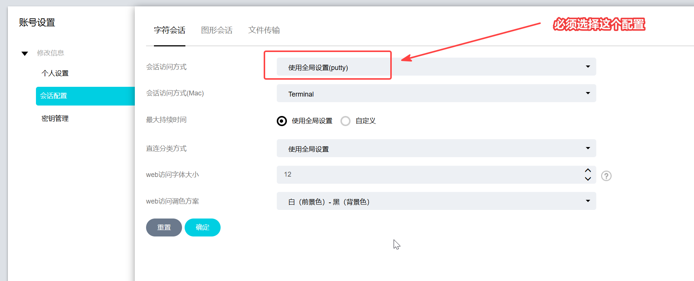
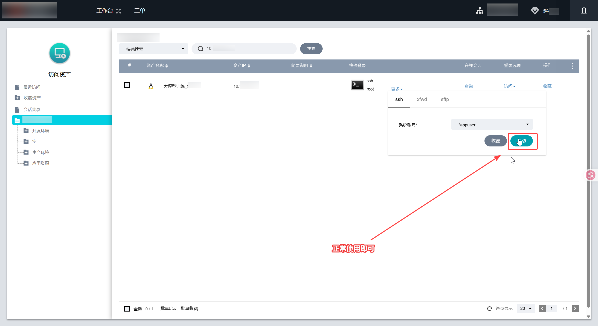

# Terminal-Agent * 快速安装手册

本手册适用于 Windows 独立 ZIP 安装包。ZIP 解压后可以在不依赖仓库目录的情况下完成 AccessClient 中继配置和 Terminal-Agent 安装。

## ZIP 内容

- `putty.exe`：Terminal-Agent 随附的 AccessClient 中继程序。
- `Terminal-Agent-Setup-*.exe`：Terminal-Agent Windows 安装包。
- `快速安装脚本.cmd`：自动识别 AccessClient 目录、复制中继程序并启动安装包。
- `快速安装手册.md`：本说明的可编辑文本版。
- `快速安装手册.pdf`：由本 Markdown 生成的打印版说明。
- `docs/images/quickstart/06-select-global-putty.png`：AccessClient 会话配置示意图。
- `docs/images/quickstart/07-launch-bastion.png`：集团堡垒机 SSH 连接示意图。

## 安装步骤

1. 将 `Terminal-Agent-Quick-Install-*.zip` 解压到一个独立文件夹。不要直接在 ZIP 压缩包内运行脚本，也不要把整个文件夹复制到 AccessClient 安装目录。
2. 阅读本手册，或打开同目录由本文件生成的 `快速安装手册.pdf`，确认下面的 AccessClient 配置要求。
3. 双击 `快速安装脚本.cmd`。脚本会自动查找 AccessClient，复制 ZIP 内的 `putty.exe` 中继程序并校验复制结果；必要时脚本会请求管理员权限，然后启动 `Terminal-Agent-Setup-*.exe`。
4. 在安装向导中选择安装目录并完成安装。安装完成后即可启动 Terminal-Agent。

如果脚本无法找到 AccessClient，请先确认 AccessClient 已正确安装，再重新运行脚本。

## 【配置须知】

在 AccessClient 的“会话配置”中，“会话访问方式”必须选择“使用全局设置(putty)”。这是 AccessClient 的厂商界面设置，快速安装脚本不会修改未知的厂商配置文件。

请确认该选项保存成功后，再从集团堡垒机发起 SSH 连接。

## 【使用须知】

请使用集团堡垒机的正常流程指定目标主机并发起 SSH 连接，不要在 AccessClient 中另行填写或替换中继程序参数。AccessClient 会通过已配置的 `putty.exe` 中继程序唤起 Terminal-Agent。

请不要将来源不明的 `putty.exe` 或安装包替换到 ZIP 中。
